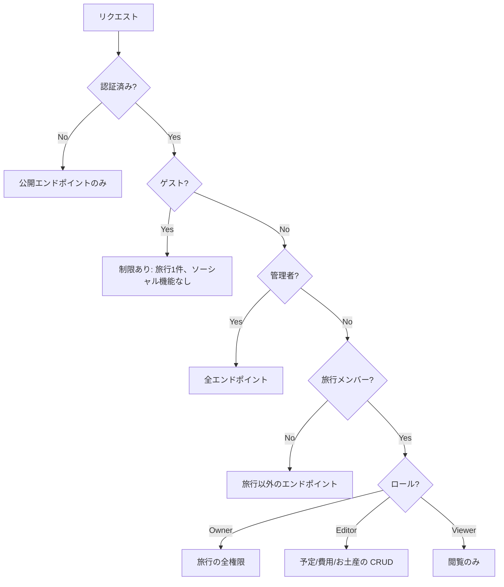

# 外部設計

## ページ一覧

### 公開ページ (認証不要)

| ルート | 説明 |
|-------|------|
| `/` | ランディングページ |
| `/auth/login` | ログイン |
| `/auth/signup` | サインアップ (招待制) |
| `/auth/forgot-password` | パスワードリセット申請 |
| `/auth/reset-password` | パスワードリセット |
| `/faq` | よくある質問 |
| `/news`, `/news/[slug]` | お知らせ |
| `/terms` | 利用規約 |
| `/privacy` | プライバシーポリシー |
| `/offline` | PWA オフラインフォールバック |
| `/shared/[token]` | 共有旅行ビュー |
| `/polls/shared/[token]` | 共有日程調整 |
| `/p/[token]` | 共有クイック投票 |
| `/users/[userId]` | 公開ユーザープロフィール |

### 認証必要ページ (デスクトップ)

| ルート | 説明 |
|-------|------|
| `/home` | ダッシュボード (旅行一覧) |
| `/trips/[id]` | 旅行詳細 (予定、候補、費用、お土産) |
| `/trips/[id]/print` | 印刷ビュー |
| `/trips/[id]/export` | Excel/CSV エクスポート |
| `/bookmarks`, `/bookmarks/[listId]` | ブックマーク管理 |
| `/friends`, `/friends/add` | フレンド管理 |
| `/polls`, `/polls/[id]` | 日程調整管理 |
| `/settings` | 設定 |
| `/my`, `/my/edit` | プロフィール |
| `/tools/roulette` | ランダム選択ツール |
| `/admin` | 管理画面 (管理者のみ、サーバーサイドで制御) |

### SP (スマートフォン)

認証必要ページは全て `/sp/...` にモバイル最適化版がある。SP 専用ルート:

| ルート | 説明 |
|-------|------|
| `/sp/notifications` | 通知一覧 (デスクトップにはない) |
| `/sp/users/[userId]` | ユーザープロフィール表示 |
| `/sp/friends/groups/[id]` | グループ詳細 |

### 表示モード切替

```mermaid
flowchart TD
    R[リクエスト] --> C{Cookie x-view-mode}
    C -->|desktop| D[デスクトップレイアウト]
    C -->|sp| S[SP レイアウト]
    C -->|なし| UA{User-Agent がモバイル?}
    UA -->|yes| S
    UA -->|no| D
    D --> RD{パスに /sp/ がある?}
    RD -->|yes| Strip[/sp/ を除去してリダイレクト]
    S --> RS{パスに /sp/ がない?}
    RS -->|yes| Add[/sp/ を付与してリダイレクト]
```

## API エンドポイント

### 認証

| メソッド | パス | 認証 | 説明 |
|---------|------|------|------|
| POST | `/api/auth/sign-up/*` | 不要 | サインアップ (管理者トグル) |
| `*` | `/api/auth/*` | 不要 | Better Auth ハンドラ |

### 旅行

| メソッド | パス | 認証 | 説明 |
|---------|------|------|------|
| GET | `/api/trips` | ユーザー | 旅行一覧 |
| POST | `/api/trips` | ユーザー | 旅行作成 (直接日付 or 投票モード) |
| GET | `/api/trips/:id` | メンバー | 旅行詳細 |
| PATCH | `/api/trips/:id` | 編集者 | 旅行更新 |
| DELETE | `/api/trips/:id` | オーナー | 旅行削除 |
| POST | `/api/trips/:id/duplicate` | メンバー | 旅行複製 |
| POST | `/api/trips/:id/cover-image` | 編集者 | カバー画像アップロード |
| DELETE | `/api/trips/:id/cover-image` | 編集者 | カバー画像削除 |

### スケジュール

| メソッド | パス | 認証 | 説明 |
|---------|------|------|------|
| GET | `.../:patternId/schedules` | メンバー | 予定一覧 |
| POST | `.../:patternId/schedules` | 編集者 | 予定作成 |
| PATCH | `.../:patternId/schedules/:id` | 編集者 | 予定更新 |
| DELETE | `.../:patternId/schedules/:id` | 編集者 | 予定削除 |
| PATCH | `.../:patternId/schedules/reorder` | 編集者 | 並び替え |
| POST | `.../:patternId/schedules/batch-delete` | 編集者 | 一括削除 |
| POST | `.../:patternId/schedules/batch-shift` | 編集者 | 一括時間シフト |
| POST | `.../:patternId/schedules/batch-duplicate` | 編集者 | 一括複製 |
| POST | `.../:tripId/schedules/batch-unassign` | 編集者 | 候補に移動 |
| POST | `.../:tripId/schedules/:id/unassign` | 編集者 | 候補に移動 |

### 候補

| メソッド | パス | 認証 | 説明 |
|---------|------|------|------|
| GET | `/api/trips/:tripId/candidates` | メンバー | 候補一覧 |
| POST | `/api/trips/:tripId/candidates` | 編集者 | 候補作成 |
| POST | `/api/trips/:tripId/candidates/batch-assign` | 編集者 | 日程に割当 |
| PUT | `.../:scheduleId/reaction` | メンバー | リアクション追加/更新 |
| DELETE | `.../:scheduleId/reaction` | メンバー | リアクション削除 |

### パターン・日程

| メソッド | パス | 認証 | 説明 |
|---------|------|------|------|
| GET | `.../:dayId/patterns` | メンバー | パターン一覧 |
| POST | `.../:dayId/patterns` | 編集者 | パターン作成 |
| PATCH | `.../:dayId/patterns/:id` | 編集者 | パターン更新 |
| DELETE | `.../:dayId/patterns/:id` | 編集者 | パターン削除 |
| POST | `.../:patternId/duplicate` | 編集者 | 複製 |
| POST | `.../:patternId/overwrite` | 編集者 | ソースで上書き |
| PATCH | `/api/trips/:tripId/days/:dayId` | 編集者 | 日程更新 |

### メンバー

| メソッド | パス | 認証 | 説明 |
|---------|------|------|------|
| GET | `/api/trips/:tripId/members` | メンバー | メンバー一覧 |
| POST | `/api/trips/:tripId/members` | オーナー | メンバー追加 |
| PATCH | `.../:userId` | オーナー | ロール変更 |
| DELETE | `.../:userId` | オーナー | メンバー削除 |

### 費用・精算

| メソッド | パス | 認証 | 説明 |
|---------|------|------|------|
| GET | `/api/trips/:tripId/expenses` | メンバー | 費用一覧 |
| POST | `/api/trips/:tripId/expenses` | 編集者 | 費用作成 |
| PATCH | `.../:expenseId` | 編集者 | 費用更新 |
| DELETE | `.../:expenseId` | 編集者 | 費用削除 |
| POST | `.../:tripId/settlement-payments` | メンバー | 精算済みにする |
| DELETE | `.../:tripId/settlement-payments/:id` | メンバー | 精算取消 |
| GET | `/api/users/:userId/unsettled-summary` | 本人 | 未精算サマリー |

### 共有 (認証不要)

| メソッド | パス | 認証 | 説明 |
|---------|------|------|------|
| POST | `/api/trips/:id/share` | オーナー | 共有リンク生成 |
| PUT | `/api/trips/:id/share` | オーナー | 共有リンク再生成 |
| GET | `/api/shared/:token` | 不要 | 共有旅行表示 |
| GET | `/api/shared/polls/:token` | 不要 | 共有日程調整表示 |
| GET | `/api/shared/quick-polls/:token` | 不要 | クイック投票表示 |
| POST | `/api/shared/quick-polls/:token/vote` | 不要 | 投票 |
| DELETE | `/api/shared/quick-polls/:token/vote` | 不要 | 投票取消 |

### ソーシャル

| メソッド | パス | 認証 | 説明 |
|---------|------|------|------|
| GET | `/api/friends` | ユーザー* | フレンド一覧 |
| POST | `/api/friends/requests` | ユーザー* | フレンド申請送信 |
| PATCH | `/api/friends/requests/:id` | ユーザー* | 申請承認/拒否 |
| DELETE | `/api/friends/:id` | ユーザー* | フレンド削除 |
| GET | `/api/groups` | ユーザー* | グループ一覧 |
| POST | `/api/groups` | ユーザー* | グループ作成 |
| GET | `/api/users/:userId/profile` | 任意 | 公開プロフィール |

*ユーザー = 認証済み + 非ゲスト

### その他

| メソッド | パス | 認証 | 説明 |
|---------|------|------|------|
| GET | `/api/bookmark-lists` | ユーザー* | ブックマークリスト |
| GET | `/api/notifications` | ユーザー | 通知一覧 |
| POST | `/api/push-subscriptions` | ユーザー | プッシュ購読登録 |
| GET | `/api/faqs` | 不要 | FAQ 一覧 |
| GET | `/api/public/settings` | 不要 | 公開設定 |
| GET | `/api/announcement` | 不要 | アナウンス |
| POST | `/api/feedback` | ユーザー | フィードバック送信 |
| GET | `/api/directions` | ユーザー | Google Maps ルート検索 |
| DELETE | `/api/account` | ユーザー | アカウント削除 |
| GET | `/health` | 不要 | ヘルスチェック |

### 管理者

| メソッド | パス | 認証 | 説明 |
|---------|------|------|------|
| GET | `/api/admin/stats` | 管理者 | 統計ダッシュボード |
| GET | `/api/admin/settings` | 管理者 | アプリ設定取得 |
| PATCH | `/api/admin/settings` | 管理者 | アプリ設定更新 |
| GET | `/api/admin/users` | 管理者 | ユーザー一覧 |
| POST | `/api/admin/users/:id/temp-password` | 管理者 | 一時パスワード発行 |
| POST | `/api/admin/announcement` | 管理者 | アナウンス設定 |

## 認可モデル



### ロール別権限

| 操作 | Owner | Editor | Viewer |
|------|-------|--------|--------|
| 旅行の閲覧 | o | o | o |
| 予定の編集 | o | o | - |
| 費用管理 | o | o | - |
| メンバー管理 | o | - | - |
| 旅行削除 | o | - | - |
| 共有リンク生成 | o | - | - |
