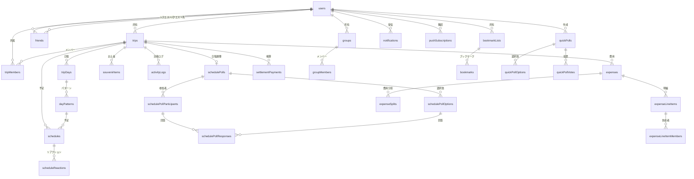
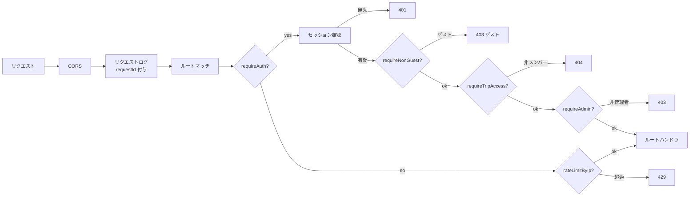
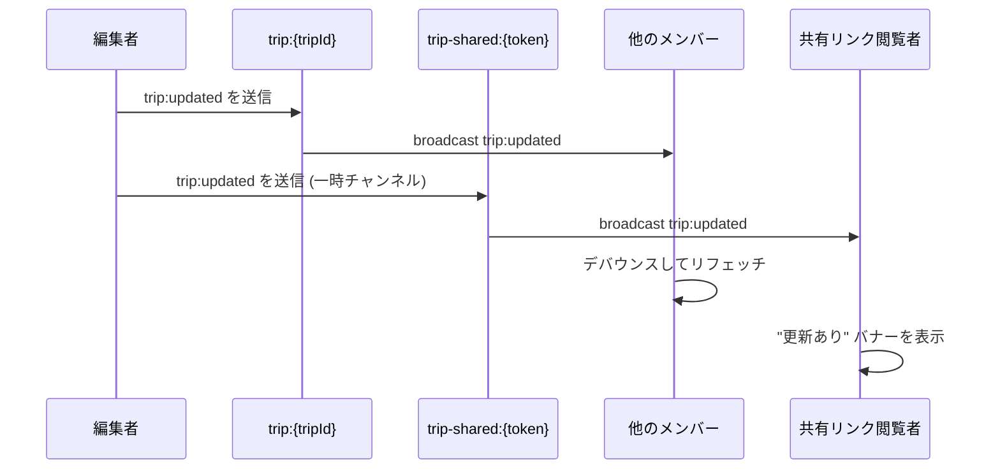

# 内部設計

## データベーススキーマ

### ER 図 (主要テーブル)



### テーブルグループ

**認証 (Better Auth 管理):** users, sessions, accounts, verifications

**旅行コア:** trips, tripMembers, tripDays, dayPatterns, schedules, scheduleReactions

**日程調整:** schedulePolls, schedulePollOptions, schedulePollParticipants, schedulePollResponses

**費用:** expenses, expenseSplits, expenseLineItems, expenseLineItemMembers, settlementPayments

**ソーシャル:** friends, groups, groupMembers

**ブックマーク:** bookmarkLists, bookmarks

**クイック投票:** quickPolls, quickPollOptions, quickPollVotes

**その他:** activityLogs, notifications, notificationPreferences, pushSubscriptions, souvenirItems, faqs, appSettings, routeCache

### 主要な設計判断

- **UUID 主キー** -- 全テーブルで `gen_random_uuid()` を使用。Better Auth は `advanced.database.generateId: "uuid"` で設定
- **カスケード削除** -- 全外部キーに `CASCADE` を設定。旅行を削除すると関連データも全て削除される
- **単一行設定テーブル** -- `appSettings` は `CHECK (id = 1)` で1行のみ保証
- **複合主キー** -- 中間テーブルは複合主キーを使用: `tripMembers(tripId, userId)`, `expenseSplits(expenseId, userId)` 等
- **フレンドの一意性** -- `UNIQUE(least(requesterId, addresseeId), greatest(...))` で方向に関係なく重複を防止
- **整数金額** -- 全ての金額は整数 (円単位)。浮動小数点は使わない

### Enum 一覧

| Enum | 値 |
|------|-----|
| tripStatus | scheduling, draft, planned, active, completed |
| tripMemberRole | owner, editor, viewer |
| transportMethod | train, shinkansen, bus, taxi, walk, car, airplane |
| scheduleCategory | sightseeing, restaurant, hotel, transport, activity, other |
| scheduleColor | blue, red, green, yellow, purple, pink, orange, gray |
| expenseSplitType | equal, custom, itemized |
| expenseCategory | transportation, accommodation, meals, communication, supplies, entertainment, conference, other |
| pollStatus | open, confirmed, closed |
| pollResponse | ok, maybe, ng |
| weatherType | sunny, partly_cloudy, cloudy, mostly_cloudy, light_rain, rainy, heavy_rain, thunder, snowy, sleet, foggy |
| reactionType | like, hmm |
| friendStatus | pending, accepted |
| bookmarkListVisibility | private, friends_only, public |
| souvenirPriority | high, medium |
| souvenirShareStyle | recommend, errand |
| quickPollStatus | open, closed |
| notificationType | member_added, member_removed, role_changed, schedule_created, schedule_updated, schedule_deleted, poll_started, poll_closed, expense_added, settlement_checked |

## モジュール構成

### API (`apps/api/src/`)

```
routes/           ルートハンドラ (ドメインごとに1ファイル)
middleware/        認証, レート制限, 旅行アクセス制御, リクエストログ
db/
  schema.ts       全テーブル + リレーション定義
  index.ts        DB 接続 (env.DATABASE_URL)
  migrate.ts      マイグレーション実行 (MIGRATION_URL)
  seed-faqs.ts    FAQ シーダー (MIGRATION_URL)
lib/
  auth.ts         Better Auth インスタンス
  env.ts          環境変数アクセサ
  logger.ts       Pino ロガー
  constants.ts    エラーメッセージ, 上限値
  permissions.ts  旅行アクセス検証 (checkTripAccess, verifyDayAccess, verifyPatternAccess)
  settlement.ts   費用精算計算 (貪欲法アルゴリズム)
  activity-logger.ts  活動ログ記録 (fire-and-forget)
  notifications.ts    プッシュ通知送信
```

### Web (`apps/web/`)

```
app/
  (authenticated)/    デスクトップレイアウトグループ
  (sp)/sp/            SP レイアウトグループ
  admin/              管理画面 (サーバーサイドで認可)
  auth/               ログイン, サインアップ, パスワードリセット
  shared/             公開共有ビュー
  api/[[...route]]/   Hono API マウントポイント
proxy.ts              ミドルウェア (認証ガード, SP リダイレクト, CSP)
lib/
  hooks/
    use-trip-sync.ts      リアルタイム同期 (Presence + Broadcast)
    use-friends-sync.ts   フレンドリアルタイム同期
    use-reaction.ts       フローティングリアクション
  api.ts              API クライアント (認証 Cookie 付き fetch ラッパー)
  supabase.ts         Supabase クライアントインスタンス
  query-keys.ts       React Query キーファクトリ
```

### Shared (`packages/shared/src/`)

```
schemas/          Zod バリデーションスキーマ (旅行, 予定, 費用など)
types.ts          API とフロントエンドで共有するレスポンス型
limits.ts         MAX_TRIPS_PER_USER, MAX_SCHEDULES_PER_TRIP など
messages.ts       ユーザー向けメッセージ (エラー, 成功, 上限)
```

## ミドルウェアチェーン



## リアルタイムアーキテクチャ

### チャンネル種別

| チャンネル | 参加者 | 機能 |
|-----------|--------|------|
| `trip:{tripId}` | 旅行メンバー (認証済み) | Broadcast + Presence |
| `trip-shared:{shareToken}` | 共有リンク閲覧者 | Broadcast 受信のみ |
| `friends:{userId}` | フレンドページの閲覧者 | Broadcast (フレンドリスト更新) |

### ブロードキャストフロー (旅行編集時)



`trip-shared` へのブロードキャストは一時チャンネルパターンを使用: subscribe -> send -> cleanup (500ms 遅延)。`use-friends-sync.ts` と同じパターン。

## テスト戦略

| レイヤー | ツール | 場所 | 件数 |
|---------|-------|------|------|
| 単体 (API) | Vitest | `apps/api/src/__tests__/` | 約560件 |
| 単体 (Web) | Vitest + jsdom | `apps/web/lib/__tests__/`, コロケーション | 約464件 |
| 単体 (Shared) | Vitest | `packages/shared/src/__tests__/` | 約150件 |
| E2E | Playwright | `apps/web/e2e/` | 約30ファイル |
| 結合 | Vitest | `apps/api/src/__tests__/integration/` | テスト DB が必要 |

### Git Hooks (lefthook)

| フック | チェック内容 |
|-------|-----------|
| pre-commit | `turbo check-types` + `turbo check` (Biome) |
| commit-msg | Conventional Commits 形式 |
| pre-push | `turbo test` (全単体テスト) |
