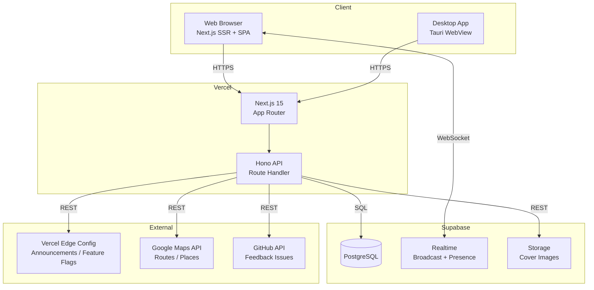
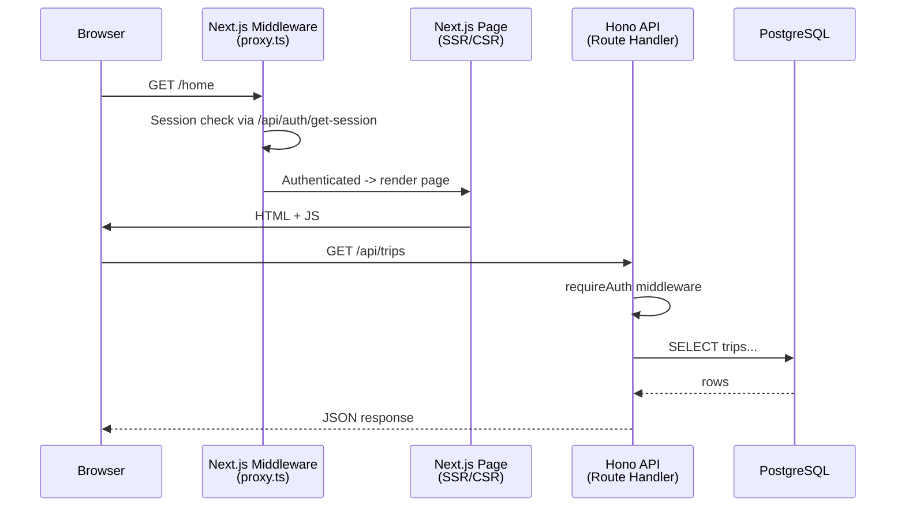
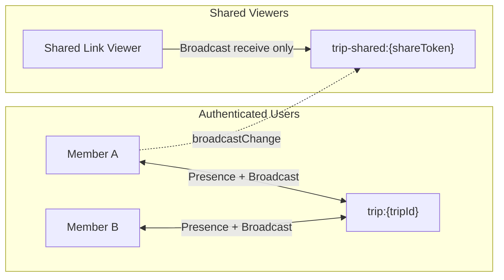
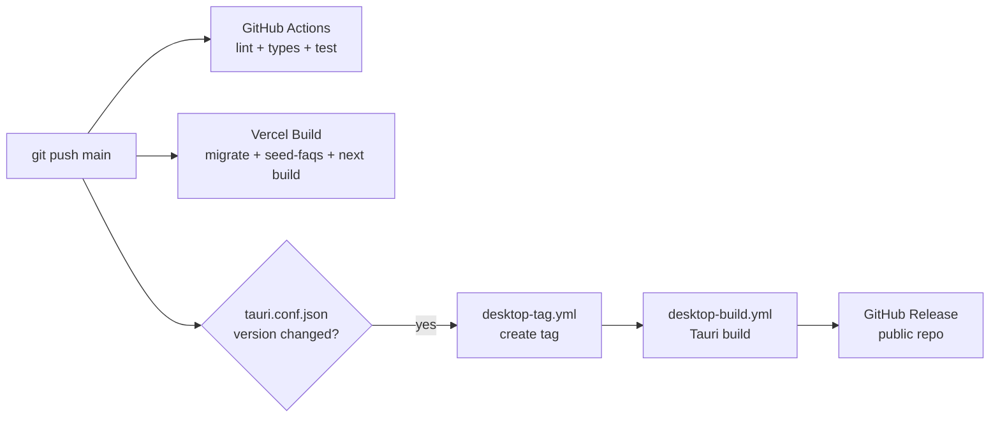

# sugara Architecture Overview

## System Architecture



## Tech Stack

| Layer | Technology |
|-------|-----------|
| Frontend | Next.js 15 (App Router), React 19, Tailwind CSS v4, shadcn/ui |
| API | Hono (Next.js Route Handler として統合) |
| Database | Supabase PostgreSQL + Drizzle ORM |
| Realtime | Supabase Realtime (Broadcast + Presence) |
| Auth | Better Auth (email/password, invite-only) |
| Validation | Zod (shared package) |
| Desktop | Tauri (macOS + Windows) |
| CI/CD | GitHub Actions, Vercel, Dependabot |
| Linter | Biome |
| Test | Vitest (unit/integration), Playwright (E2E) |

## Monorepo Structure

```
sugara/
  apps/
    web/          Next.js frontend + API route handler
    api/          Hono API routes, DB schema, auth
    desktop/      Tauri desktop app (WebView wrapper)
  packages/
    shared/       Zod schemas, types, constants
```

`apps/web` is the deployment target. `apps/api` is imported by `apps/web` as a Route Handler at `apps/web/app/api/[[...route]]/route.ts`. They share types and validation schemas via `packages/shared`.

## Request Flow



## Realtime Communication

Two channel types isolate authenticated members from shared-link viewers:



- `trip:{tripId}` -- Members-only channel for Presence (who's online) and mutual broadcast
- `trip-shared:{shareToken}` -- Shared viewers receive update notifications without accessing tripId

## Auth Model

- **Better Auth** with email/password credentials
- Signup is invite-only (admin-controlled toggle via Edge Config)
- Guest accounts: limited to 1 trip, no friends/bookmarks/groups
- Admin: identified by `ADMIN_USER_ID` env var

## Deployment



- Web: Vercel auto-deploy on push to main. `turbo-ignore` skips if no relevant changes.
- Desktop: Version bump in `tauri.conf.json` triggers tag -> build -> release pipeline.
- DB migrations run automatically during Vercel build via `MIGRATION_URL` (direct connection).
