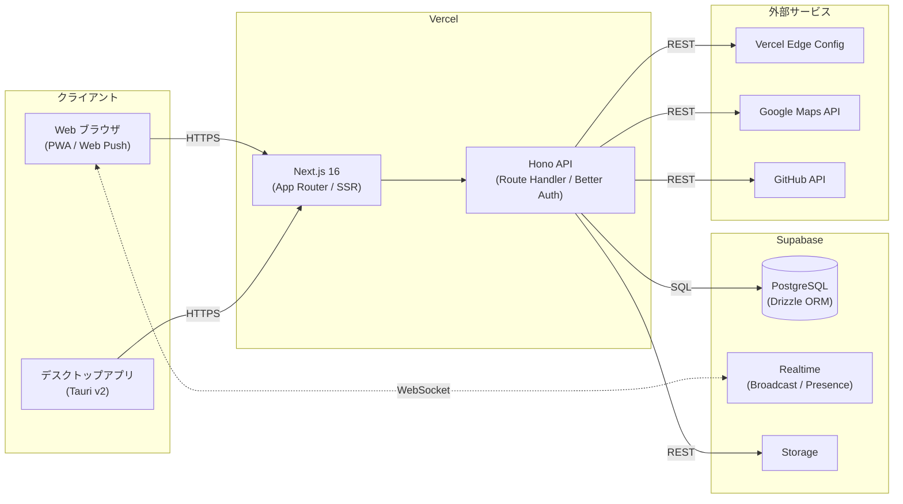
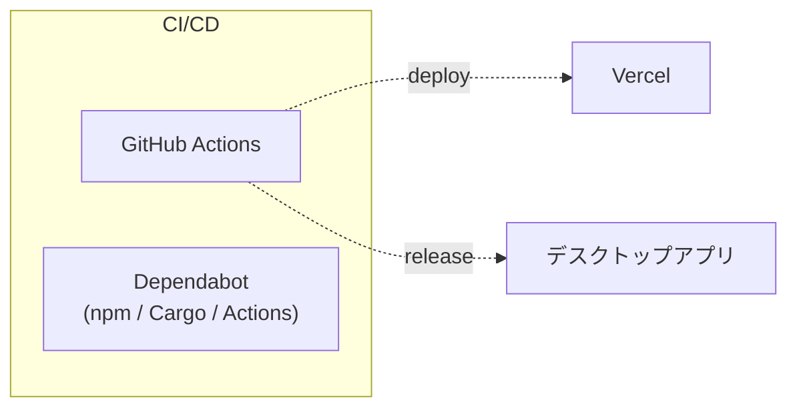

# 全体設計

## システム構成図

## CI/CD

- Web: main への push で Vercel が自動デプロイ。`turbo-ignore` で関連変更がなければスキップ
- デスクトップ: `tauri.conf.json` のバージョン変更 → タグ作成 → ビルド → リリース
- DB マイグレーションは Vercel ビルド時に `MIGRATION_URL` (Direct Connection) 経由で自動実行

## 認証モデル

- **Better Auth** によるメール/パスワード認証
- サインアップは管理者が開放/停止を制御 (appSettings テーブル)
- ゲストアカウント: 旅行1件まで、フレンド/ブックマーク/グループは利用不可
- 管理者: 環境変数 `ADMIN_USER_ID` で識別
