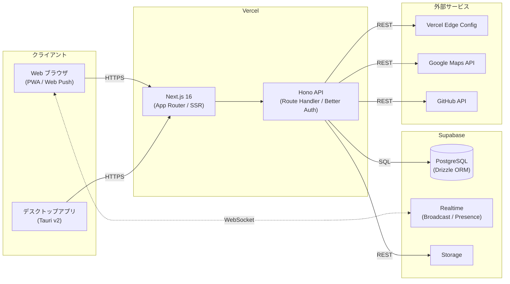
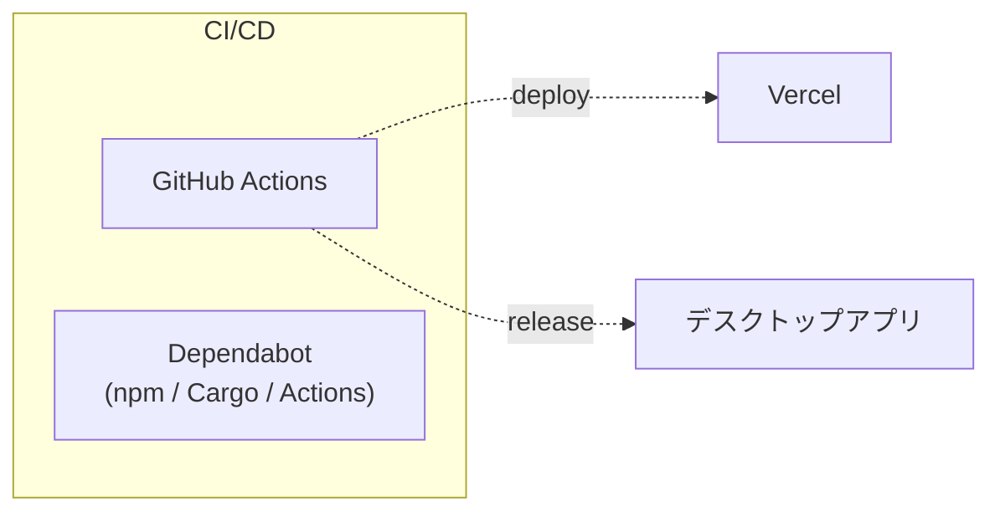
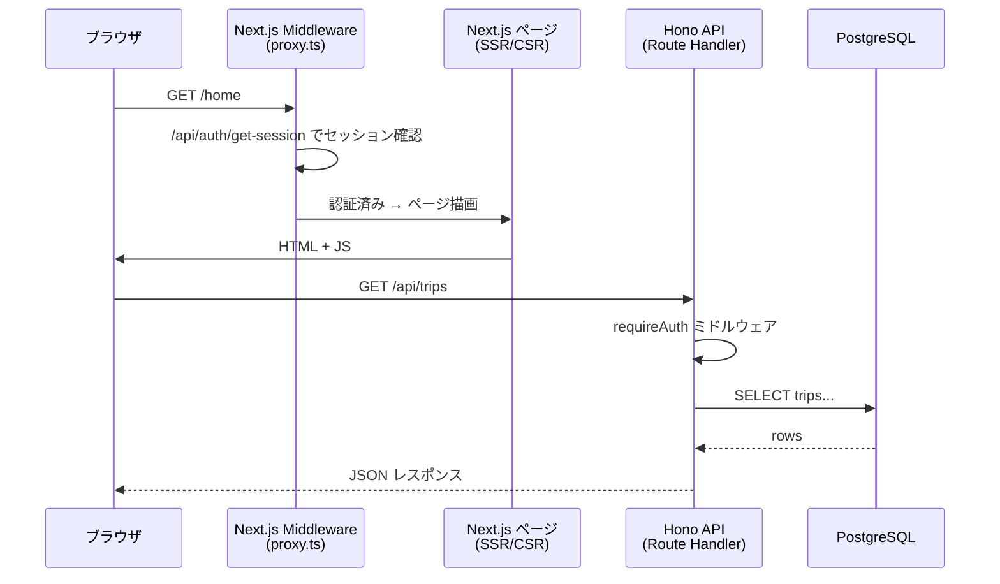
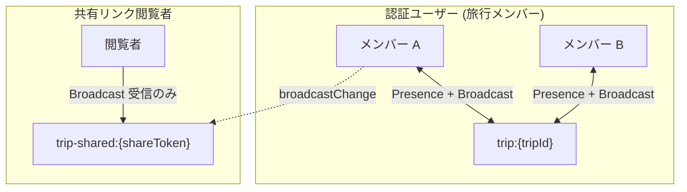
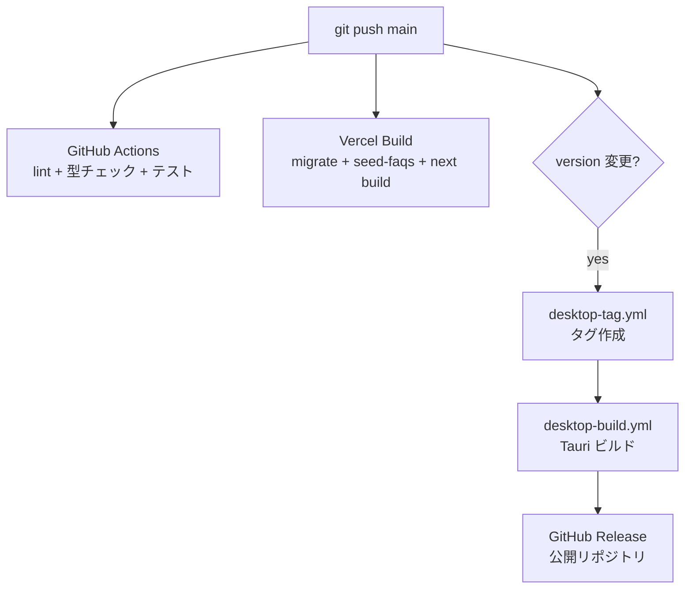

# 全体設計

## システム構成図





## 技術スタック

| レイヤー | 技術 |
|---------|------|
| フロントエンド | Next.js 16 (App Router), React 19, Tailwind CSS v4, shadcn/ui |
| API | Hono (Next.js Route Handler として統合) |
| データベース | Supabase PostgreSQL + Drizzle ORM |
| リアルタイム | Supabase Realtime (Broadcast + Presence) |
| 認証 | Better Auth (メール/パスワード、管理者が新規登録を制御) |
| バリデーション | Zod (shared パッケージで共有) |
| デスクトップ | Tauri (macOS + Windows) |
| CI/CD | GitHub Actions, Vercel, Dependabot |
| リンター | Biome |
| テスト | Vitest (単体/結合), Playwright (E2E) |

## モノレポ構成

```
sugara/
  apps/
    web/          Next.js フロントエンド + API ルートハンドラ
    api/          Hono API ルート, DB スキーマ, 認証
    desktop/      Tauri デスクトップアプリ (WebView ラッパー)
  packages/
    shared/       Zod スキーマ, 型定義, 定数
```

`apps/web` がデプロイ対象。`apps/api` は `apps/web/app/api/[[...route]]/route.ts` で Route Handler として統合される。`packages/shared` で型とバリデーションスキーマを共有。

## リクエストフロー



## リアルタイム通信

認証ユーザーと共有リンク閲覧者を2種類のチャンネルで分離:



- `trip:{tripId}` -- メンバー専用チャンネル。Presence (オンライン状況) と相互 Broadcast
- `trip-shared:{shareToken}` -- 共有閲覧者が更新通知を受信。tripId を知らないため Presence 汚染を防止

## 認証モデル

- **Better Auth** によるメール/パスワード認証
- サインアップは管理者が開放/停止を制御 (appSettings テーブル)
- ゲストアカウント: 旅行1件まで、フレンド/ブックマーク/グループは利用不可
- 管理者: 環境変数 `ADMIN_USER_ID` で識別

## デプロイ



- Web: main への push で Vercel が自動デプロイ。`turbo-ignore` で関連変更がなければスキップ
- デスクトップ: `tauri.conf.json` のバージョン変更 → タグ作成 → ビルド → リリース
- DB マイグレーションは Vercel ビルド時に `MIGRATION_URL` (Direct Connection) 経由で自動実行
